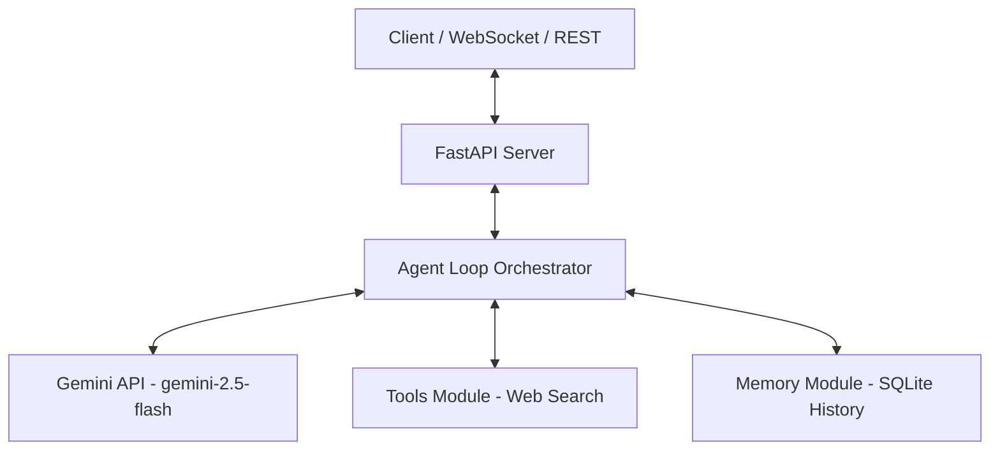

# Live AI Assistant

A Python-based backend server for a Live AI Assistant, capable of real-time web search, dynamic tool calling, and persistent conversation memory.

---

## 🏗️ Architecture Overview

The system is designed with a modular architecture for real-time WebSocket communication and persistent historical context:



### Key Modules:
- **`server/main.py`**: API gateway implementing REST paths and WebSocket paths for real-time bidirectional streaming.
- **`server/agent.py`**: AI orchestrator managing context injection, Gemini model invocation, and tool routing.
- **`server/tools.py`**: Extensible interface for search tools (Tavily/Google Search APIs) and custom utility functions.
- **`server/memory.py`**: Database models & query operations mapping conversations to persistent local SQLite storage.

---

## 📂 File Directory Structure

```
Live-Ai-Assistant/
├── config/
│   └── agent_config.yaml     # System prompts, tools toggles, and temperature settings
├── server/
│   ├── __init__.py
│   ├── main.py               # FastAPI entry point, REST endpoints, and WebSocket streaming stubs
│   ├── agent.py              # Agent loop, chat history injection, and Google GenAI client
│   ├── tools.py              # Search engine integration (Tavily / Google CSE)
│   ├── memory.py             # ChatMessage SQLAlchemy schema and database CRUD handlers
│   └── database.py           # SQLAlchemy database engines and session configurations
├── .env.example              # Template configuration for API credentials
├── .gitignore                # Global ignore rules for runtime and IDE files
├── requirements.txt          # Python project package dependencies
└── README.md                 # Project architecture and setup guide (This file)
```

---

## 🚀 Getting Started

### Prerequisites
- Python 3.10 or higher
- A Google Gemini API Key (from [Google AI Studio](https://aistudio.google.com/))
- (Optional) A Tavily Search API Key (from [Tavily](https://tavily.com/))

### 1. Installation
Clone the repository and navigate to the project directory:
```bash
git clone https://github.com/gaurigotmare27/Live-Ai-Assistant.git
cd Live-Ai-Assistant
```

Create and activate a Python virtual environment:
```bash
# On Windows
python -m venv venv
venv\Scripts\activate

# On macOS/Linux
python3 -m venv venv
source venv/bin/activate
```

Install the dependencies:
```bash
pip install -r requirements.txt
```

### 2. Configuration
Copy the environment variables template and configure your API keys:
```bash
cp .env.example .env
```
Open `.env` and enter your credentials:
```env
GEMINI_API_KEY=your_real_gemini_api_key_here
TAVILY_API_KEY=your_tavily_api_key_here
```

### 3. Run the Development Server
Launch the server using Uvicorn:
```bash
python server/main.py
```
Or run directly:
```bash
uvicorn server.main:app --reload
```
The server will start at [http://127.0.0.1:8000](http://127.0.0.1:8000).

---

## 🔌 API Documentation

### REST API
- **`GET /`**: Health check.
- **`POST /api/chat`**: Send a message to the assistant under a specific `session_id`. Updates and retrieves persistent session memory automatically.
  - **Body**:
    ```json
    {
      "session_id": "session-123",
      "message": "What is the latest news about NASA Artemis?"
    }
    ```
- **`DELETE /api/chat/{session_id}`**: Clear the conversation history stored in SQLite database for the specified session ID.

### WebSockets API
- **`WS /ws/live/{session_id}`**: WebSocket connection for real-time text/media bidirectional interactions.
  - Accepts text inputs.
  - Returns responses in streaming JSON structures.
